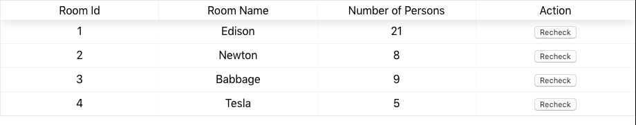

Please use this repository to maintain your work for the team project.

Also please fill the following details:

- Team name: Operation Bravo
- Students (SCS username - Name):
	- tiie2231@scs.ubbcluj.ro - Tamas Florin
	- svie2228@scs.ubbcluj.ro - Stanila Vlad
	- taie2233@scs.ubbcluj.ro - Tili Adrian
	- umie2239@scs.ubbcluj.ro - Ungur Maria

## Project idea:
Meeting room monitoring system(provide information on the number persons in the room).

This application demonstrates how to use a camera in order to detect the number of persons in a room. 
The application is provided as a web page where the user is provided with the information.
The web page communicates with a machine learning server via REST and outputs the received prediction.

## Slave (PIServer)
The PI server is used in order to retrieve screenshots from a particular meeting room.
The images are used by the machine learning model in order to make a prediction regarding
the number of persons in the room.

## Master (Machine learning model)
The master server responds to the rest request from the client, returning the number of persons for each available room.
An example of response from the master server is as follows:
```
{
    "rooms": [
        {
            "num_persons": 1,
            "room_name": "Room #1"
        }
    ]
}
```

## Client
The client is provided as a web page created using React and displays the number of persons for each available room.
The user can also view a 'live feed' of the model's bounding box detections by accessing the 'view feed' functionality.



## Pre-requisites

- Android Things compatible board
- Android Studio 2.2+
- 1 Android Things compatible camera

## Schematics


## Build and install

# PIServer

On Android Studio, click on the "Run" button.

If you prefer to run on the command line, type

```bash
./gradlew installDebug
adb shell am start ro.ubbcluj.cs.tamasf.roomspy/.MainActivity
```

If you have everything set up correctly, the server should be sending data to the client.

# Machine learning server
First make sure that all of the necessary dependencies are installed by running the following command:

```
pip install -r requirements.txt
```

Since the server is dependent on the machine learning model we first need to retrieve it using the helper script:
```
chmod +x get_yolo.sh
./get_yolo.sh
```

Now we can start the server by running the following command:

```
python3 server.py
```

The server should now be running and handling requests from the client.

# Client
Install all the necessary packages:
```
npm install
```

Run the project:
```
npm start
```

=============

Due: last laboratory.
	Either May 16th or May 23rd, depending on your laboratory frequency.
	Please note that we are obeying the faculty student group assignments.
Details:
- A team of 4 or 5 students to tackle a real-world problem.
- Choose an existing project proposed by the lab instructor.
- Define a new one, together with the lab instructor.
Expected outcome:
- The source code should be hosted in this github classroom repository.
- A webpage presenting the project results, similar to:
	https://androidthings.withgoogle.com/#!/samples/doorbell
- A short video presenting the results.

